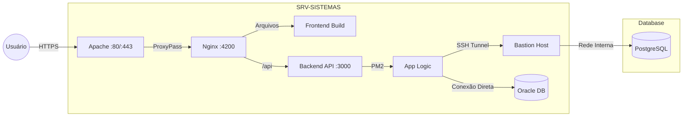

# Recicle Hub (Public Demo)


[](https://nodejs.org/)
[](https://angular.dev/)
[](https://www.typescriptlang.org/)
[](https://tailwindcss.com/)
[](LICENSE)

Versão de demonstração pública do sistema de gestão de reciclagem desenvolvido para o Grupo Barcelos. Esta versão utiliza dados mockados e pode ser executada localmente sem dependências de infraestrutura.

> **Demonstração de Portfólio:** Este repositório contém dados fictícios gerados localmente. A versão em produção opera com PostgreSQL, Oracle Database, túneis SSH e autenticação JWT completa.


https://lucaswotta.github.io/recicle-hub-public/

---

## Contexto do Projeto Original

### Visão Geral

Sistema full-stack desenvolvido para centralizar a gestão de reciclagem corporativa, incluindo cadastro de recicladores, registro de pesagens, dados financeiros e geração de variados relatórios para auditoria.

### Arquitetura de Produção



### Stack Tecnológica

**Backend:**
- Node.js 18 + Express
- PostgreSQL 16 (dados de produção)
- Oracle 19c (usuários e auditoria)
- JWT dual-token (access + refresh)
- SSH tunnel (Bastion Host pattern)
- Helmet.js + Rate Limiting
- Validação Zod

**Frontend:**
- Angular 20 (Standalone Components)
- TypeScript 5.8
- TailwindCSS 3.x
- D3.js (visualizações)
- Signals API
- Change Detection: OnPush

**Infraestrutura:**
- PM2 (gerenciamento de processos)
- Nginx (web server + reverse proxy)
- Apache (roteamento DNS)
- Deploy automatizado via shell script
- Logs rotativos (pm2-logrotate)

---

## Funcionalidades Implementadas

### Dashboard Inicial

- Query consolidada única (redução de 87.5% em consultas)
- Cache HTTP de 2 minutos
- Gráficos interativos D3.js (barras, pizza, linha)
- Métricas em tempo real (clientes, reciclagem, receita)
- Ranking de performance

### Gestão de Clientes

- CRUD completo com validação
- Paginação dinâmica (ajusta por altura disponível)
- Filtros avançados (busca, tipo PF/PJ, status)
- Máscara de telefone automática
- Reset de senha com hash bcrypt
- Auditoria de alterações

### Relatórios Financeiros

- Geração de Excel (.xlsx) com ExcelJS
- Proteção por senha configurável
- Estilização de headers e totalizadores
- Suporte a filtros de data
- 6 tipos de relatórios (saldo, resgates, clientes, transações, reciclagem, ranking)

### Segurança

- Autenticação JWT com rotação de refresh token
- Access token em memória (15min)
- Refresh token HTTP-only cookie (7 dias)
- Rate limiting (5 tentativas/15min no login)
- CORS configurável
- Cookies SameSite=Strict
- RBAC (Admin, Support, Viewer)
- Logs de auditoria no Oracle

### Performance

- Change Detection OnPush em 100% dos componentes
- Signals API para memoização automática
- Lazy loading de dados
- Skeleton loading (800ms mínimo)
- Pool de conexões otimizado (PG: 20, Oracle: 10)

---

## Demonstração Pública

### O que está Disponível

Esta versão permite explorar a interface e experiência do usuário completa:

- ✅ Dashboard interativo com gráficos D3.js
- ✅ Gestão de clientes (listagem, edição, filtros)
- ✅ Sistema de autenticação simulado
- ✅ Geração de relatórios Excel mockados
- ✅ Logs de auditoria fictícios
- ✅ Todos os componentes visuais e interações
- ✅ Sistema de notificações (toast)
- ✅ Navegação completa entre módulos

### Adaptações para Demo

**Camada de Mocks:**
```
frontend/src/
├── mocks/
│   ├── clients.mock.ts       # 50+ clientes fictícios
│   ├── dashboard.mock.ts     # Métricas e gráficos
│   ├── reports.mock.ts       # Templates de relatórios
│   ├── users.mock.ts         # Usuários do sistema
│   └── audit-logs.mock.ts    # Histórico de ações
└── services/
    └── api.service.ts        # Intercepta chamadas e retorna mocks
```

**Removido:**
- Conexões reais com banco de dados
- Túnel SSH e credenciais sensíveis
- Secrets JWT e hashes de senha
- Integração Oracle
- Variáveis de ambiente com dados corporativos

**Mantido:**
- 100% do código frontend original
- Lógica de validação e regras de negócio
- Sistema de roteamento e guards
- Interceptors HTTP
- Estrutura de componentes standalone
- Padrões de arquitetura

---

## Execução Local

### Pré-requisitos

```bash
Node.js 18+
npm 9+
```

### Instalação

```bash
# Clone o repositório
git clone https://github.com/lucaswotta/recicle-hub-public.git
cd recicle-hub-public

# Instale dependências
cd frontend
npm install

# Inicie o servidor de desenvolvimento
npm run dev

# Acesse http://localhost:4200
```

### Credenciais de Demonstração

Login funciona com qualquer usuário mockado:

| Usuário | Senha | Role | Descrição |
|---------|-------|------|-----------|
| admin | 123 | Admin | Acesso total ao sistema |
| support | 123 | Support | Sem acesso a saldo e relatórios |
| viewer | 123 | Viewer | Apenas visualização de relatórios |

---

## Estrutura do Projeto

### Frontend

```
frontend/src/
├── app/
│   ├── components/          # Componentes standalone
│   │   ├── home/           # Dashboard + gráficos D3.js
│   │   ├── clients/        # CRUD de clientes
│   │   ├── reports/        # Geração de relatórios
│   │   ├── settings/       # Gestão de usuários
│   │   ├── login/          # Autenticação
│   │   ├── sidebar/        # Navegação
│   │   └── toast/          # Notificações
│   ├── services/           # Serviços Angular
│   │   ├── api.service.ts      # HTTP Client + mocks
│   │   ├── auth.service.ts     # Autenticação
│   │   ├── data.service.ts     # Estado global
│   │   └── toast.service.ts    # Sistema de toast
│   ├── guards/             # Route guards (RBAC)
│   ├── interceptors/       # HTTP interceptors
│   ├── models/             # Interfaces TypeScript
│   └── mocks/              # Dados mockados
└── environments/           # Configurações de ambiente
```

### Backend (Referência)

O código backend foi mantido sanitizado para demonstrar a arquitetura original:

```
backend/
├── index.js              # Configuração Express + middlewares
├── auth.js               # Lógica JWT (sanitizado)
├── db.js                 # Pool PG + Oracle (sanitizado)
└── routes/
    ├── home.js           # Endpoint de métricas
    ├── clients.js        # CRUD de clientes
    ├── settings.js       # Usuários + auditoria
    └── reports.js        # Geração de Excel
```

> [!WARNING]
> O backend não é necessário para executar esta demo. Ele está incluído apenas como referência de arquitetura.

---

## Comparação: Demo vs Produção

| Aspecto | Demo Pública | Produção |
|---------|--------------|----------|
| Dados | Mockados (50 clientes fictícios) | PostgreSQL + Oracle |
| Autenticação | Simulada (aceita qualquer senha) | JWT dual-token + bcrypt |
| Banco de Dados | Nenhum | PostgreSQL 16 + Oracle 19c |
| Infraestrutura | Localhost apenas | PM2 + Nginx + Apache + SSH Tunnel |
| Relatórios | Gerados em memória | Excel protegido por senha |
| Logs | Fictícios | Oracle Database (auditoria completa) |
| Deploy | Github Pages | Script automatizado + CI/CD |
| Performance | Cliente apenas | Cache HTTP + Pool de conexões |
| Segurança | Sem validação real | OWASP + Rate Limiting + CORS |

---

## Tecnologias e Conceitos Demonstrados

### Arquitetura

- [x] Aplicação Full-Stack (Node.js + Angular)
- [x] Arquitetura de três camadas
- [x] API RESTful
- [x] Padrão Bastion Host (SSH Tunnel)
- [x] Reverse Proxy (Nginx + Apache)
- [x] Banco de dados híbrido (PostgreSQL + Oracle)

### Backend

- [x] Express.js com middlewares customizados
- [x] Pool de conexões otimizado
- [x] Validação de dados (Zod)
- [x] Geração de arquivos Excel (ExcelJS)
- [x] Sistema de auditoria
- [x] Rate limiting e proteção OWASP
- [x] JWT dual-token com rotação

### Frontend

- [x] Angular 20 (Standalone Components)
- [x] Signals API e Computed Properties
- [x] Change Detection OnPush
- [x] Route Guards (RBAC)
- [x] HTTP Interceptors
- [x] Reactive Forms
- [x] Visualizações D3.js
- [x] TailwindCSS responsivo
- [x] Sistema de notificações (Toast)
- [x] Paginação dinâmica
- [x] Skeleton loading

### DevOps

- [x] Deploy automatizado (shell script)
- [x] Gerenciamento de processos (PM2)
- [x] Rotação de logs
- [x] Variáveis de ambiente
- [x] Documentação técnica

**Otimizações aplicadas:**
- Ahead-of-Time (AOT) compilation
- Tree shaking
- Minificação de CSS/JS
- Ivy engine
- Lazy loading de rotas

---

## Licença

Este projeto de demonstração é distribuído sob licença MIT. Veja [LICENSE](LICENSE) para detalhes.

---

**Desenvolvido por Lucas Motta**  
[GitHub](https://github.com/lucaswotta) • [LinkedIn](https://www.linkedin.com/in/lucaswotta)